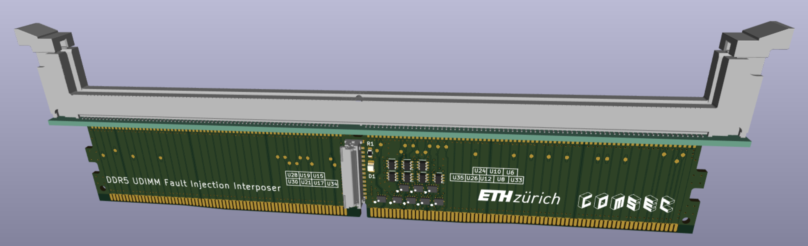
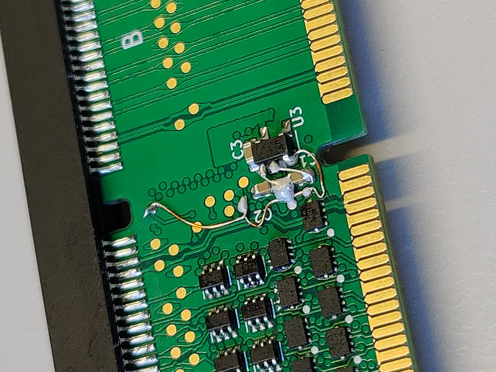

# Interposer PCB for DDR5 UDIMMs
Hardware files for the fault injection interposer of
REFault: A Fault Injection Platform for Rowhammer Research on DDR5 Memory.

The interposer consists of a 6-layer PCB that can be used in between an off-the-shelf
DDR5-compatible motherboard and an DDR5 SDRAM UDIMM. Some signals
can be forced high or low by an external control signal to inject
or suppress certain DRAM commands.

## Design
The schematic and PCB was designed in KiCAD. Open `hardware/udimm_interposer.kicad_pro` in KiCAD 8 or later to view the design files.
From there, you should be able to select the schematic and PCB layout.

For convenience, you can also find a PDF version of the schematic in `docs/schematic.pdf`. A bill of materials (BOM) is also provided in `docs`.

## Manufacturing
The PCBs were manufactured by JLCPCB and were assembled by hand.
It is reasonable to also order an SMT stencil, so soldering is easier.
The Gerber files needed for manufacturing are located at `hardware/output`.

### Impedance Control
The PCB is impedance controlled. It uses the JLC06121H-1080 stackup options.

### Manufacturing options
| Option | Value |
|--------|-------|
|Base Material| FR-4|
|Layers| 6|
|Dimension| 133.4 mm * 21.9 mm|
|Product Type| Industrial/Consumer electronics|
|Different Design| 1|
|Delivery Format| Single PCB|
|PCB Thickness| 1.2|
|Impedance Control| yes JLC06121H-1080|
|Layer Sequence||
|PCB Color| Green|
|Silkscreen| White|
|Via Covering| Tented|
|Surface Finish| ENIG|
|Deburring/Edge rounding| No|
|Outer Copper Weight| 1|
|Inner Copper Weight| 0.5|
|Gold Fingers| Yes|
|Flying Probe Test|Fully Test|
|Castellated Holes|no|
|Remove Order Number|No|
|Min hole size/diameter|0.3/0.4mm|
|4-Wire Kelvin Test|No|
|Material Type|FR4-Standard TG 135-140|
|Paper between PCBs|No|
|Appearance Quality|IPC Class 2 Standard|
|Confirm Production file|Yes|
|Silkscreen Technology|Ink-jet/Screen Printing Silkscreen|
|Package Box|With JLCPCB logo|

**Warning**: For future orders, it may be a better idea to not select "Gold Fingers",
because we do not want chamfering along the edge connector. As far as
the PCB manufacturer is concerned, the edge connector consists of normal
pads. Otherwise add an explicit remark that you do not want any chamfering.

## Assembly
Assembly can be done manually using a stencil (ordered with the PCB),
some solder paste and a hot air gun. The connector on top was soldered
manually.
### Bill of Materials (BOM)
See docs/bom

### Verification
To ensure that there are no shorts between pins and all pins are properly
soldered, a continuity check should be performed prior to testing
the module more thoroughly with e.g. Memtest86+.

## Known Issuses
Since the UDIMM connector is comparatively long, the PCB might experience
thermal warping along the length of the connector, lifting the PCB away
from the connectors of the DIMM. For this reason, the connector was soldered
on manually.

### Modifications
Note that suitable 1.1 V voltage regulators in an SOT23-5 package
with the first pin being GND are difficult to source.
To circumvent this, we recommend to choose any other voltage regulator
with a standard pinout and swapping pin 1 and 2 accordingly.
This should be fixed in future PCB revisions.

Some switches are not connected to the flat flex connector.
To hard-wire them to the "passthrough" position, a wire must be soldered
to the appropriate pads on the voltage regulator side of the PCB.
Check the schematic and design files for details.

## License
Some parts of the PCB may be subject to copyright of third parties
(e.g. 3D models provided by manufacturer).
Otherwise, the design is released under MIT License.
